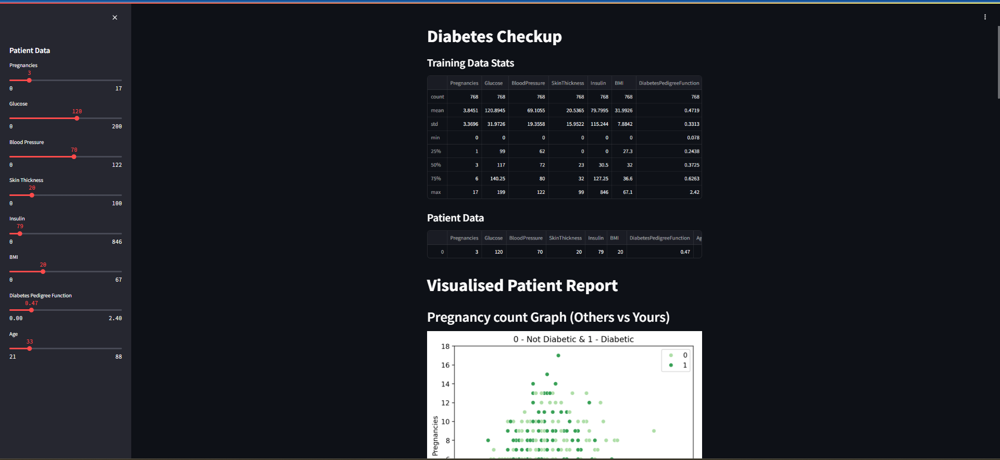

# Type-2 Diabetes Prediction Web App

This web application predicts the likelihood of type-2 diabetes in patients using the PIMA Indians Diabetes Database. The application is built using Streamlit, a Python library for creating web apps for machine learning and data science projects.


The web app is hosted on Heroku. You can access it using the following link:

[Type-2 Diabetes Prediction Web App](https://type2-diabetes-ml-predictor-328dc76a07da.herokuapp.com/)




## Table of Contents

- [Overview](#overview)
- [Features](#features)
- [Installation](#installation)
- [Usage](#usage)
- [Dataset](#dataset)
- [Technologies Used](#technologies-used)

## Overview

This web app allows users to input various health metrics such as pregnancies, glucose level, blood pressure, skin thickness, insulin level, BMI, diabetes pedigree function, and age to predict whether the user is likely to have diabetes. The prediction is made using a Random Forest Classifier trained on the PIMA Indians Diabetes Database.

## Features

- Input patient data through a user-friendly sidebar.
- Display training data statistics.
- Predict whether the patient has diabetes.
- Visualize patient data compared to the training dataset.
- Display prediction accuracy.

## Installation

### Prerequisites

- Python 3.9 or higher
- pip (Python package installer)

### Steps

1. Clone the repository:
   ```sh
   git clone https://github.com/your-username/type2-diabetes-prediction.git
   cd type2-diabetes-prediction
   ```

2. Create a virtual environment:
   ```sh
   python -m venv venv
   ```

3. Activate the virtual environment:
   - On Windows:
     ```sh
     venv\Scripts\activate
     ```
   - On macOS/Linux:
     ```sh
     source venv/bin/activate
     ```

4. Install the required packages:
   ```sh
   pip install -r requirements.txt
   ```

## Usage

1. Run the Streamlit app:
   ```sh
   streamlit run app.py
   ```

2. Open a web browser and navigate to `http://localhost:8501`.

3. Enter the patient data in the sidebar and view the prediction and visualizations.

## Dataset

The dataset used is the [PIMA Indians Diabetes Database](https://www.kaggle.com/datasets/uciml/pima-indians-diabetes-database) available on Kaggle. This dataset consists of several medical predictor variables and one target variable, Outcome. Predictor variables include the number of pregnancies, glucose level, blood pressure, skin thickness, insulin level, BMI, diabetes pedigree function, and age.

## Technologies Used

- **Python**: Programming language used.
- **Streamlit**: Framework for creating the web application.
- **pandas**: Data manipulation and analysis library.
- **scikit-learn**: Machine learning library used for model building.
- **seaborn** and **matplotlib**: Libraries for data visualization.
- **plotly**: Interactive graphing library.
